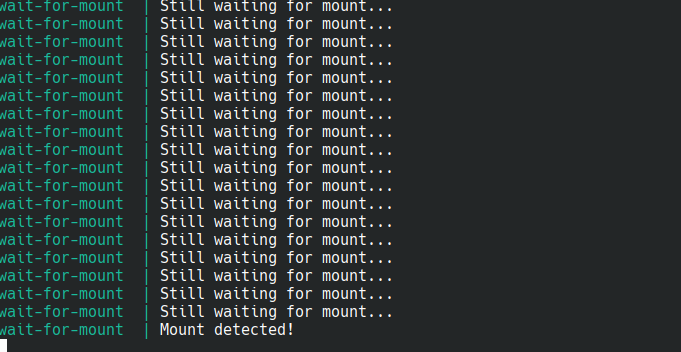

# Docker Compose Mount Check & Auto-Systemd (for Immich)

A fail-safe Docker Compose utility and systemd lifecycle manager to **automatically start Immich whenever an external drive is mounted**, perform deep pre-flight safety checks, protect against hot unplugs, and integrate natively with Linux desktop environments (like KDE Plasma).



---

## 🌟 Key Features

1. **Auto-Start on Mount (`systemd`)**: Binds the Docker Compose stack to your drive's systemd mount unit (`BindsTo=`). When you plug in or mount your drive, Immich starts automatically.
2. **Deep Pre-Flight Safety Checks**:
   * **Kernel Mount Validation**: Verifies the path is an active kernel mountpoint, not an empty directory on your host SSD root partition.
   * **Read-Write Probe**: Tests write permissions to catch read-only mounts caused by ext4 journal errors or unclean shutdowns.
   * **Disk Identity Marker**: Checks for `.mount_verified` on the drive root to prevent starting against the wrong disk.
   * **Storage Sanity Check**: Ensures minimum free space before booting containers.
   * **Docker Readiness**: Confirms Docker daemon is active and responsive.
3. **Hot-Unplug & Unmount Protection**:
   * If the drive is unmounted or unexpectedly disconnected, systemd immediately triggers a defensive stop, stopping containers and cleaning up dead handles without hanging the Docker daemon.
   * On clean unmounts, containers are stopped *before* the filesystem is unmounted (inverting systemd shutdown order), preventing `EBUSY` (device busy) errors.
4. **KDE Plasma & Desktop Integration**:
   * **Interactive Safe Eject GUI**: Run `scripts/immich-eject.sh --gui` or search **"Safely Eject Immich Drive"** in KRunner (Alt+Space) or the Application Launcher for a native `kdialog` confirmation and status popups.
   * **Dolphin File Manager Menu**: Right-click your mount directory in Dolphin to access **Immich Drive Actions** (Safe Eject, Restart Stack, Check Status).
5. **100% Privacy & Generic Design**:
   * Zero personal usernames, paths, or device identifiers are tracked in Git.
   * Works for any mount point, any disk label, and can be swapped for any Docker Compose stack.

---

## 🚀 Quick Start

### Step 1: Configure Your Local `.env`
Copy the template and set your paths:
```bash
cp .env.example .env
```

Edit `.env`:
```env
# 1. How your drive mounts on the host (e.g., /media/username/my-external-drive or /mnt/my-drive)
EXTERNAL_MOUNT_PARENT=/media/username
EXTERNAL_MOUNT_NAME=my-external-drive

# 2. Where your Immich data lives
UPLOAD_LOCATION=/media/username/my-external-drive/immich/uploads   # External HDD
DB_DATA_LOCATION=/home/username/immich/db                          # Host OS SSD (Recommended)
```

---

### Step 2: Setup Automated Systemd & Desktop Integration
Run the universal installer script:
```bash
./setup-autosystemd.sh
```

This will automatically:
* Compute your systemd mount unit name via `systemd-escape`.
* Create the `.mount_verified` marker file on your external drive.
* Generate and install `/etc/systemd/system/immich.service`.
* Enable `immich.service` to auto-start on mount.
* Install the KDE Desktop launcher and Dolphin right-click context menu.
* Run an immediate pre-flight safety check.

---

## 🛠️ CLI & Desktop Utilities

| Action | Command / Location | Description |
|---|---|---|
| **Safe Eject (GUI)** | KRunner / App Menu: *Safely Eject Immich Drive*<br>Or CLI: `./scripts/immich-eject.sh --gui` | Prompts with `kdialog`, stops Immich, flushes buffers (`sync`), unmounts disk, and notifies when safe to disconnect. |
| **Safe Eject (CLI)** | `./scripts/immich-eject.sh` | Terminal version of the safe eject workflow. |
| **Run Safety Pre-Check** | `./scripts/immich-precheck.sh` | Runs all 6 pre-flight safety checks and reports status. |
| **Graceful Stop** | `./scripts/immich-stop.sh` | Safely stops containers and flushes disk buffers with defensive timeouts. |
| **Uninstall Systemd** | `./setup-autosystemd.sh --uninstall` | Disables and removes the systemd service and desktop integrations. |

---

## 🏗️ Architecture & Dual-Layer Protection

```
┌────────────────────────────────────────────────────────┐
│                   USB Drive Plugged In                 │
└──────────────────────────┬─────────────────────────────┘
                           │
                           ▼
┌────────────────────────────────────────────────────────┐
│      Systemd Mount Unit (e.g. mnt-storage.mount)       │
└──────────────────────────┬─────────────────────────────┘
                           │ (Triggers WantedBy)
                           ▼
┌────────────────────────────────────────────────────────┐
│             systemd unit: immich.service               │
│        (BindsTo & After = mnt-storage.mount)           │
└──────────────────────────┬─────────────────────────────┘
                           │
                           ▼
┌────────────────────────────────────────────────────────┐
│ ExecStartPre: scripts/immich-precheck.sh               │
│  ✔ Kernel mount table check (mountpoint -q)            │
│  ✔ Read-Write probe (detects dirty / ro remounts)      │
│  ✔ Marker file (.mount_verified)                       │
│  ✔ DB directory & storage sanity checks                │
└──────────────────────────┬─────────────────────────────┘
                           │ (All checks pass)
                           ▼
┌────────────────────────────────────────────────────────┐
│ ExecStart: docker compose up -d                        │
│  ✔ wait-for-mount container verifies rslave mount      │
│  ✔ Immich Server, ML, Postgres, Valkey start cleanly   │
└────────────────────────────────────────────────────────┘

┌────────────────────────────────────────────────────────┐
│               HOT UNPLUG / UNMOUNT EVENT               │
└──────────────────────────┬─────────────────────────────┘
                           │ (Mount deactivates)
                           ▼
┌────────────────────────────────────────────────────────┐
│ ExecStop: scripts/immich-stop.sh                       │
│  ✔ Graceful docker compose down with timeout           │
│  ✔ Defensive cleanup for unresponsive hanging I/O      │
│  ✔ Stack stopped cleanly without hanging Docker daemon │
└────────────────────────────────────────────────────────┘
```

---

## 📄 License
This project is licensed under the [MIT License](LICENSE).
